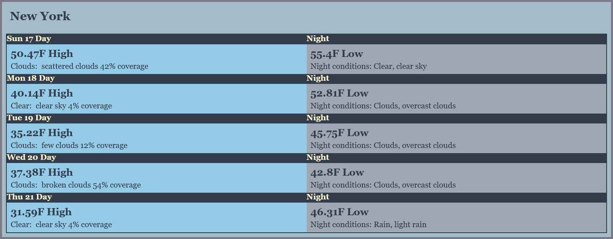
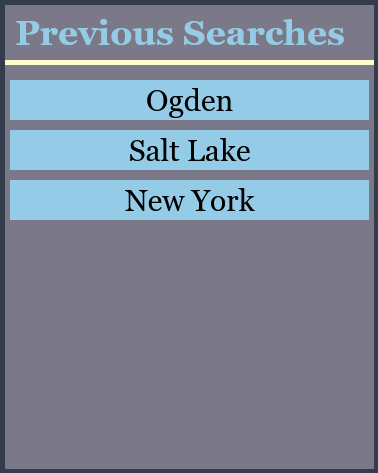
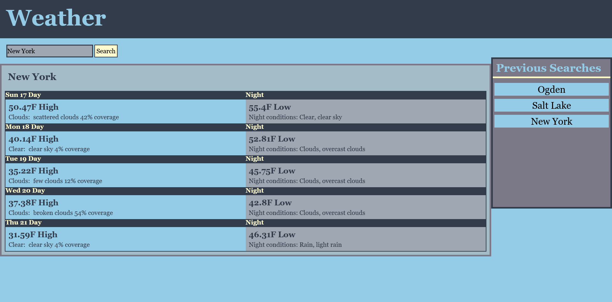

# WeatherApp

## Description
This application will help a user see the conditions and temperature of a city they’d like to visit. It displays the forecast for five days, conditions for night and day, and cloud coverage. The user can compare previous searches that are saved in the local storage and plan their week with the weather in mind.
## Link
[WeatherApp](https://captianbeau.github.io/WeatherApp/)
## Usage
Type the city into the search bar and press the search button.\
\
The Five day Forecast will display in the forecast area.\
\
Previous searches will appear in the Previous search area and when the buttons are clicked the previous search Forecast will display in the forecast area.\

## ScreenShots
 

## License

MIT License

